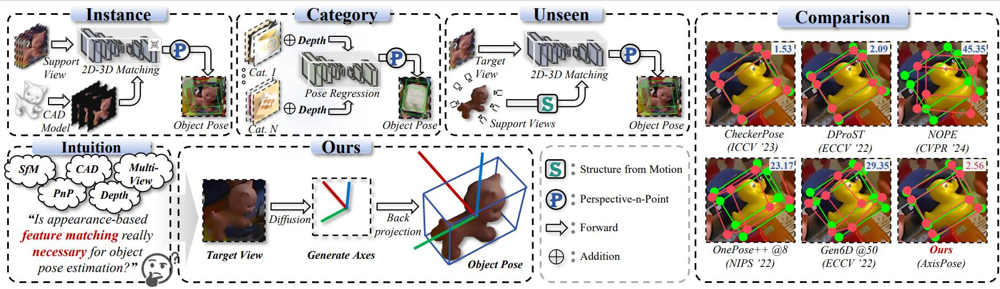

# Axispose

### Environment
To set up the required environment, run the following commands：
```
pip install -r requirment.txt
```

### Model Inference
We use GPU A100-40G with CUDA 12.2 to train and test our model. To sample our pretrained model, run the following commands:
```
python main.py --config {DATASET}.yml --exp {PROJECT_PATH} --doc {MODEL_NAME} --sample --fid --timesteps 1000 --eta 0 --ni
```
where 
- `STEPS` controls how many timesteps used in the process.
- `MODEL_NAME` finds the pre-trained checkpoint according to its inferred path.

We provide a pretrained model and some test images ([here](https://pan.baidu.com/s/1vHRCJRdTW4xTADf5x-PikQ?pwd=i68v)) for evaluation. Note: Put the checkpoint file under "./weight/", and put test images (RGB & Mask) under "./sample/". 

## References and Acknowledgements
If you use this work in your research, please cite:
```
@article{zou2025axispose,
  title={AxisPose: Model-Free Matching-Free Single-Shot 6D Object Pose Estimation via Axis Generation},
  author={Zou, Yang and Qi, Zhaoshuai and Liu, Yating and Xu, Zihao and Sun, Weipeng and Liu, Weiyi and Li, Xingyuan and Yang, Jiaqi and Zhang, Yanning},
  journal={arXiv preprint arXiv:2503.06660},
  year={2025}
}
```

This implementation is based on / inspired by:

- [https://github.com/ermongroup/ddim](https://github.com/ermongroup/ddim) (the DDIM TensorFlow repo), 
- [https://github.com/pesser/pytorch_diffusion](https://github.com/pesser/pytorch_diffusion) (PyTorch helper that loads the DDPM model), and
- [https://github.com/ermongroup/ncsnv2](https://github.com/ermongroup/ncsnv2) (code structure).
